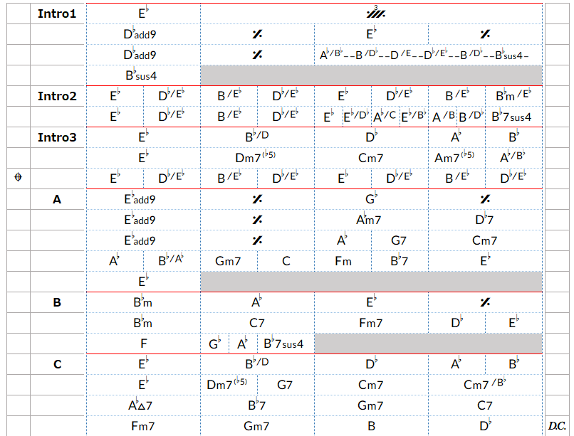
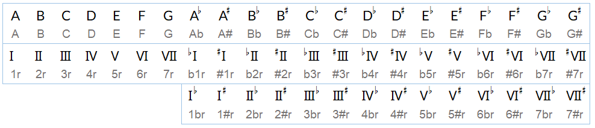
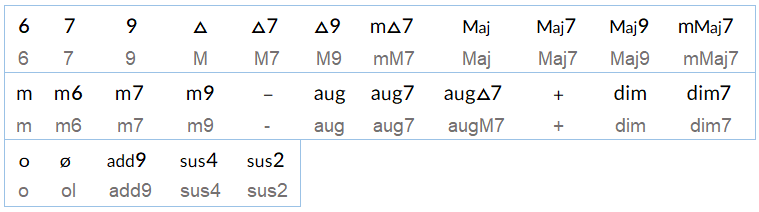
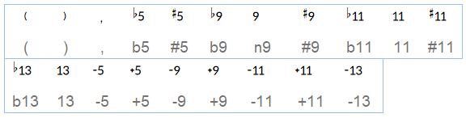
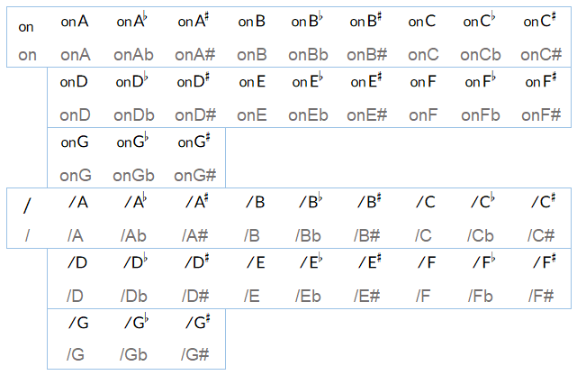

# KomeMusicalChords




KomeMusicalChords was created for easy notation of musical chords.

The main concepts of this typeface are

- To display chords as a web font in a typeface that blends well with other typefaces.
- Compact the width and ensure visibility of a chord as a lead sheet to play music.
- Allow for flexible notation while maintaining chord integrity.

The total number of fonts is 195 as of v1.0, and 156 are intended to be used. Most of them are composed of ligature.

##  Caution

When using this font as a Web font, the following must be described in addition to the CSS description normally used(because it assumes the use of ligatures).

```
    font-variant-ligatures: common-ligatures;
    -moz-font-feature-settings: "liga";
    -webkit-font-feature-settings: "liga";
    font-feature-settings: "liga";
```

## Roles

This typeface is built around ligatures and must be entered according to the rules.

However, your creative notations may be allowed.

| Parts      | Description                                                  | Example          |
| ---------- | ------------------------------------------------------------ | ---------------- |
| root       | the root note of the chord                                   | `A`,`Ab`,`A#`    |
| degree     | The root note of the chord is represented by a Roman numeral. | `1r`,`b1r`,`#1r` |
| structure  | the underlying structure of the code                         | `M`,`m`,`M7`     |
| additional | Structures that can be added to structure                    | `add9`,`sus4`    |
| tension    | Represents a tension code                                    | `b9`,`#11`       |
| inversion  | Represents the bass that is the inversion.                   | `onA`,`/A`       |
| another    | A collection of musical symbols that are not chords but are useful for creating lead sheets | `DC`,`fine`      |

1. root & degree

   
   
   First of all, you must determine the root note of the chord.
   The root note can be selected from the following
   
   - `A`,`B`,`C`,`D`,`E`,`F`,`G`
   
   If you want to add Accidentals to the root note, put `b`(for flat) or `#`(for sharp) after the root. 
   
   Example : `Ab`,`A#`
   
   If you want to use roman numerals for the degree notation, please add the number you want to use followed by an `r`.
   
   Example : `1r`
   
   When adding Accidentals in Degree notation, prefix the number with `b`,`#`.
   
   Example : `b1r`,`#1r`
   
2. structure & additional

   

   After the root is determined, it must be decided whether it is a minor or major chord.

   Put the required chord notation (structure) after the root.

   Example : `AM` (A Major Triad)
   
   Example : `Am7` (A minor 7th)

   After entering the chord notation (structure), consider adding elements that are additional.
   
   Example : `Amadd9`,`Asus4`

3. tension

   
   
   If you wish to use tension, feel free to do so. It does not matter if you add parentheses or not. 
   
   Example : `Am7(b5)`,`Am7-5`

   Multiple tensions can be indicated by separating with comma. 
   
   Example : `Am7(b5,#9)`

4. inversion

   
   
   If you want to determine the bass separately from the root note of the chord, you can use `on` or `/`.
   
   Example : `A7onC#`,`A7/C#`

## Glyph list

| No   | Parts      | Category | Name                        | Input Words |
| ---- | ---------- | -------- | --------------------------- | ----------- |
| 1    | root       | word     | root_A                      | A           |
| 2    | root       | word     | root_B                      | B           |
| 3    | root       | word     | root_C                      | C           |
| 4    | root       | word     | root_D                      | D           |
| 5    | root       | word     | root_E                      | E           |
| 6    | root       | word     | root_F                      | F           |
| 7    | root       | word     | root_G                      | G           |
| 8    | root       | ligature | root_A_flat                 | Ab          |
| 9    | root       | ligature | root_A_sharp                | A#          |
| 10   | root       | ligature | root_B_flat                 | Bb          |
| 11   | root       | ligature | root_B_sharp                | B#          |
| 12   | root       | ligature | root_C_flat                 | Cb          |
| 13   | root       | ligature | root_C_sharp                | C#          |
| 14   | root       | ligature | root_D_flat                 | Db          |
| 15   | root       | ligature | root_D_sharp                | D#          |
| 16   | root       | ligature | root_E_flat                 | Eb          |
| 17   | root       | ligature | root_E_sharp                | E#          |
| 18   | root       | ligature | root_F_flat                 | Fb          |
| 19   | root       | ligature | root_F_sharp                | F#          |
| 20   | root       | ligature | root_G_flat                 | Gb          |
| 21   | root       | ligature | root_G_sharp                | G#          |
| 22   | root       | ligature | root_1st                    | 1r          |
| 23   | root       | ligature | root_2nd                    | 2r          |
| 24   | root       | ligature | root_3rd                    | 3r          |
| 25   | root       | ligature | root_4th                    | 4r          |
| 26   | root       | ligature | root_5th                    | 5r          |
| 27   | root       | ligature | root_6th                    | 6r          |
| 28   | root       | ligature | root_7th                    | 7r          |
| 29   | root       | ligature | root_1st_flat               | 1br         |
| 30   | root       | ligature | root_1st_sharp              | 1#r         |
| 31   | root       | ligature | root_2nd_flat               | 2br         |
| 32   | root       | ligature | root_2nd_sharp              | 2#r         |
| 33   | root       | ligature | root_3rd_flat               | 3br         |
| 34   | root       | ligature | root_3rd_sharp              | 3#r         |
| 35   | root       | ligature | root_4th_flat               | 4br         |
| 36   | root       | ligature | root_4th_sharp              | 4#r         |
| 37   | root       | ligature | root_5th_flat               | 5br         |
| 38   | root       | ligature | root_5th_sharp              | 5#r         |
| 39   | root       | ligature | root_6th_flat               | 6br         |
| 40   | root       | ligature | root_6th_sharp              | 6#r         |
| 41   | root       | ligature | root_7th_flat               | 7br         |
| 42   | root       | ligature | root_7th_sharp              | 7#r         |
| 43   | degree     | ligature | degree_1st_flat             | b1r         |
| 44   | degree     | ligature | degree_1st_sharp            | #1r         |
| 45   | degree     | ligature | degree_2nd_flat             | b2r         |
| 46   | degree     | ligature | degree_2nd_sharp            | #2r         |
| 47   | degree     | ligature | degree_3rd_flat             | b3r         |
| 48   | degree     | ligature | degree_3rd_sharp            | #3r         |
| 49   | degree     | ligature | degree_4th_flat             | b4r         |
| 50   | degree     | ligature | degree_4th_sharp            | #4r         |
| 51   | degree     | ligature | degree_5th_flat             | b5r         |
| 52   | degree     | ligature | degree_5th_sharp            | #5r         |
| 53   | degree     | ligature | degree_6th_flat             | b6r         |
| 54   | degree     | ligature | degree_6th_sharp            | #6r         |
| 55   | degree     | ligature | degree_7th_flat             | b7r         |
| 56   | degree     | ligature | degree_7th_sharp            | #7r         |
| 57   | structure  | word     | Major_6th                   | 6           |
| 58   | structure  | word     | dominant_7th                | 7           |
| 59   | structure  | word     | dominant_9th                | 9           |
| 60   | structure  | word     | Major                       | M           |
| 61   | structure  | ligature | Major_7th                   | M7          |
| 62   | structure  | ligature | Major_9th                   | M9          |
| 63   | structure  | ligature | minorMajor_7th              | mM7         |
| 64   | structure  | ligature | Major(another)              | Maj         |
| 65   | structure  | ligature | Major_7th(another)          | Maj7        |
| 66   | structure  | ligature | Major_9th(another)          | Maj9        |
| 67   | structure  | ligature | minor_Major_7th(another)    | mMaj7       |
| 68   | structure  | word     | minor                       | m           |
| 69   | structure  | ligature | minor_6th                   | m6          |
| 70   | structure  | ligature | minor_7th                   | m7          |
| 71   | structure  | ligature | minor_9th                   | m9          |
| 72   | structure  | word     | minor(another)              | -           |
| 73   | structure  | ligature | augment                     | aug         |
| 74   | structure  | ligature | augment_7th                 | aug7        |
| 75   | structure  | ligature | augment_Major_7th           | augM7       |
| 76   | structure  | word     | augment(another)            | +           |
| 77   | structure  | ligature | diminished                  | dim         |
| 78   | structure  | ligature | diminished_7th              | dim7        |
| 79   | structure  | word     | diminished(another)         | o           |
| 80   | structure  | ligature | harf-diminished             | ol          |
| 81   | additional | ligature | add9th                      | add9        |
| 82   | additional | ligature | suspended 4th               | sus4        |
| 83   | additional | ligature | suspended 2nd               | sus2        |
| 84   | tension    | word     | left parenthesis            | (           |
| 85   | tension    | word     | right  parenthesis          | )           |
| 86   | tension    | word     | comma                       | ,           |
| 87   | tension    | ligature | tension_5th_flat            | b5          |
| 88   | tension    | ligature | tension_5th_sharp           | #5          |
| 89   | tension    | ligature | tension_9th_flat            | b9          |
| 90   | tension    | ligature | tension_9th                 | n9          |
| 91   | tension    | ligature | tension_9th_sharp           | #9          |
| 92   | tension    | ligature | tension_11th_flat           | b11         |
| 93   | tension    | ligature | tension_11th                | 11          |
| 94   | tension    | ligature | tension_11th_sharp          | #11         |
| 95   | tension    | ligature | tension_13th_flat           | b13         |
| 96   | tension    | ligature | tension_13th                | 13          |
| 97   | tension    | ligature | tension_5th_flat(another)   | -5          |
| 98   | tension    | ligature | tension_5th_sharp(another)  | +5          |
| 99   | tension    | ligature | tension_9th_flat(another)   | -9          |
| 100  | tension    | ligature | tension_9th_sharp(another)  | +9          |
| 101  | tension    | ligature | tension_11th_flat(another)  | -11         |
| 102  | tension    | ligature | tension_11th_sharp(another) | +11         |
| 103  | tension    | ligature | tension_13th_flat(another)  | -13         |
| 104  | inversion  | ligature | on                          | on          |
| 105  | inversion  | ligature | onA                         | onA         |
| 106  | inversion  | ligature | onA_flat                    | onAb        |
| 107  | inversion  | ligature | onA_sharp                   | onA#        |
| 108  | inversion  | ligature | onB                         | onB         |
| 109  | inversion  | ligature | onB_flat                    | onBb        |
| 110  | inversion  | ligature | onB_sharp                   | onB#        |
| 111  | inversion  | ligature | onC                         | onC         |
| 112  | inversion  | ligature | onC_flat                    | onCb        |
| 113  | inversion  | ligature | onC_sharp                   | onC#        |
| 114  | inversion  | ligature | onD                         | onD         |
| 115  | inversion  | ligature | onD_flat                    | onDb        |
| 116  | inversion  | ligature | onD_sharp                   | onD#        |
| 117  | inversion  | ligature | onE                         | onE         |
| 118  | inversion  | ligature | onE_flat                    | onEb        |
| 119  | inversion  | ligature | onE_sharp                   | onE#        |
| 120  | inversion  | ligature | onF                         | onF         |
| 121  | inversion  | ligature | onF_flat                    | onFb        |
| 122  | inversion  | ligature | onF_sharp                   | onF#        |
| 123  | inversion  | ligature | onG                         | onG         |
| 124  | inversion  | ligature | onG_flat                    | onGb        |
| 125  | inversion  | ligature | onG_sharp                   | onG#        |
| 126  | inversion  | word     | /                           | /           |
| 127  | inversion  | ligature | /A                          | /A          |
| 128  | inversion  | ligature | /A_flat                     | /Ab         |
| 129  | inversion  | ligature | /A_sharp                    | /A#         |
| 130  | inversion  | ligature | /B                          | /B          |
| 131  | inversion  | ligature | /B_flat                     | /Bb         |
| 132  | inversion  | ligature | /B_sharp                    | /B#         |
| 133  | inversion  | ligature | /C                          | /C          |
| 134  | inversion  | ligature | /C_flat                     | /Cb         |
| 135  | inversion  | ligature | /C_sharp                    | /C#         |
| 136  | inversion  | ligature | /D                          | /D          |
| 137  | inversion  | ligature | /D_flat                     | /Db         |
| 138  | inversion  | ligature | /D_sharp                    | /D#         |
| 139  | inversion  | ligature | /E                          | /E          |
| 140  | inversion  | ligature | /E_flat                     | /Eb         |
| 141  | inversion  | ligature | /E_sharp                    | /E#         |
| 142  | inversion  | ligature | /F                          | /F          |
| 143  | inversion  | ligature | /F_flat                     | /Fb         |
| 144  | inversion  | ligature | /F_sharp                    | /F#         |
| 145  | inversion  | ligature | /G                          | /G          |
| 146  | inversion  | ligature | /G_flat                     | /Gb         |
| 147  | inversion  | ligature | /G_sharp                    | /G#         |
| 148  | another    | ligature | repeat 1bar                 | r1          |
| 149  | another    | ligature | repeat 2bar                 | r2          |
| 150  | another    | ligature | repeat 3bar                 | r3          |
| 151  | another    | ligature | repeat 4bar                 | r4          |
| 152  | another    | ligature | dacapo                      | DC          |
| 153  | another    | ligature | dalsegno                    | DS          |
| 154  | another    | ligature | capo                        | dc          |
| 155  | another    | ligature | segno                       | ds          |
| 156  | another    | ligature | fine                        | fine        |

## Release

Fonts are built automatically by GitHub Actions - take a look in the Latest [Releases](https://github.com/yumegekijoh/KomeMusicalChords/releases) or the "Actions" tab for the latest build .

## License

This Font Software is licensed under the SIL Open Font License, Version 1.1. This license is available with a FAQ at http://scripts.sil.org/OFL

